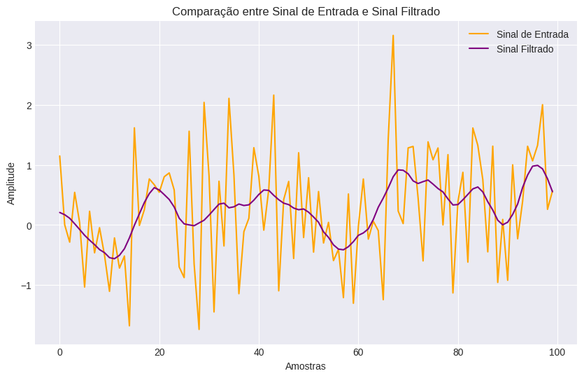

# FIR Filter em Python

Este projeto implementa um filtro FIR básico em Python para processamento digital de sinais (DSP). O filtro FIR é desenvolvido utilizando boas práticas de programação e inclui a plotagem de um gráfico comparativo entre o sinal de entrada e o sinal filtrado usando o Matplotlib.

## Teoria: Filtros FIR - Fundamentos e Aplicações

Um filtro FIR (Finite Impulse Response), é um tipo de filtro digital que utiliza uma soma ponderada de um número finito de amostras passadas da entrada para calcular a saída. Em outras palavras, a saída do filtro em um instante de tempo depende apenas das amostras de entrada anteriores, e não de futuras.

### Vantagens dos Filtros FIR

- **Estabilidade:** Sempre estáveis, confiáveis ​​e robustos.
- **Eficiência:** Implementação eficiente, adequados para aplicações em tempo real.
- **Linearidade:** Facilita análise e projeto de sistemas de processamento de sinal.
- **Flexibilidade:** Versatilidade para diversas aplicações.

### Desvantagens dos Filtros FIR

- **Resposta em frequência não ideal:** Podem apresentar ondulações na resposta em frequência, indesejáveis em algumas aplicações.
- **Maior ordem para transições mais nítidas:** Geralmente exigem uma ordem mais alta para obter transições mais nítidas na frequência de corte, aumentando a complexidade do filtro.

### Características dos Filtros FIR

#### Estabilidade
Os filtros FIR são sempre estáveis, garantindo que a saída não cresça sem limites para entradas limitadas, conferindo-lhes confiabilidade e robustez.

#### Eficiência
Podem ser implementados de forma eficiente usando estruturas de transposição, tornando-os adequados para aplicações em tempo real.

#### Linearidade
São lineares, o que implica que a resposta do filtro a uma combinação linear de duas entradas é igual à combinação linear das respostas do filtro a cada entrada individualmente.

#### Flexibilidade
Podem ser projetados para atender a uma variedade de requisitos de frequência e fase, tornando-os versáteis para diversas aplicações.

### Aplicações dos Filtros FIR

- Filtragem passa-baixa: Elimina frequências acima de uma certa frequência de corte.
- Filtragem passa-alta: Elimina frequências abaixo de uma certa frequência de corte.
- Filtragem passa-banda: Elimina frequências fora de uma faixa de frequência específica.
- Equalização: Ajusta a resposta em frequência de um sinal para compensar distorções ou melhorar a qualidade do som.
- Realce de bordas: Detecta bordas em imagens.
- Interpolação e decimação: Altera a taxa de amostragem de um sinal.

### Tipos de Filtros FIR

- **Filtros FIR de janela:** Projetados usando uma janela para suavizar a resposta em frequência do filtro.
- **Filtros FIR de frequência ideal:** Projetados para ter uma resposta em frequência ideal, mas podem apresentar ondulações na resposta.
- **Filtros FIR equiripple:** Projetados para ter uma resposta em frequência com ondulações equiripple, desejável em algumas aplicações.

## Objetivos

- Implementar um filtro FIR básico em Python.
- Demonstração do uso do filtro em um sinal de entrada simulado.
- Plotar um gráfico comparativo entre o sinal de entrada e o sinal filtrado.
  
## Visualização do Gráfico

**Nota:** O gráfico visualizado acima é apenas um exemplo ilustrativo. Como o sinal de entrada é gerado aleatoriamente, o gráfico resultante pode ser diferente a cada execução.

O filtro implementado no código é um filtro FIR (Finite Impulse Response), especificamente um filtro passa-baixa simples. Este filtro é projetado para atenuar ou eliminar frequências acima de uma determinada frequência de corte, enquanto permite a passagem de frequências mais baixas.

A classificação específica desse filtro pode ser resumida da seguinte forma:

- **Tipo:** Filtro FIR (Finite Impulse Response).
- **Característica:** Passa-baixa (ou Low-pass).
- **Método de Projeto:** Os coeficientes do filtro são calculados utilizando a função sinc, o que resulta em um filtro passa-baixa ideal.
- **Ordem do Filtro:** Determinada pelo número de coeficientes, neste caso, é um filtro de ordem 11.
- **Normalização:** Os coeficientes são normalizados para garantir que a resposta em frequência seja unitária na frequência de corte.
- **Implementação:** O filtro é implementado utilizando a função de convolução para aplicar os coeficientes do filtro ao sinal de entrada.
- **Aplicação:** Utilizado para filtrar o sinal de entrada, atenuando frequências acima de uma frequência de corte especificada.

O gráfico resultante mostra a comparação entre o sinal de entrada (em laranja) e o sinal filtrado (em roxo), destacando a atenuação das frequências mais altas pelo filtro passa-baixa.
